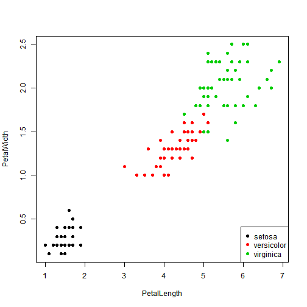
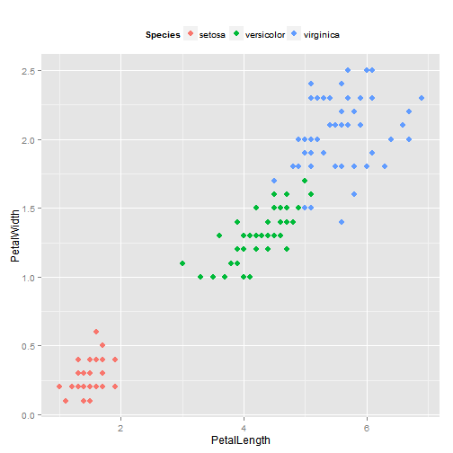

[資料科學] 整合R與Javascript的動態作圖
========================================================

R的作圖能力是公認地強悍，雖然在`base`套件裡的作圖語法十分雜亂、參數不容易微調，但我們還有許多其他的套件可以選擇，例如`ggplot2`就是在語法上有良好的統一之外，圖像各個細部上的自動（預設）微調也十分到位。一般來說，以數據分析師的角度，在進行Data Exploration階段時，我習慣順手就用`base`套件作圖，寫個幾行dirty code馬上查看結果，很夠用了。但當分析階段來到了需要對外進行溝通的時候，比方說製作文檔、進行簡報等等，我會改用`ggplot2`（另一個常被人推崇的是`lattice`套件）來「認真地」作圖。

我對R的作圖一直很滿意，直到我膝蓋中了一箭。

時代是網路，以Web基準來進行數據分析結果的溝通已是十分尋常的事情。翻譯成資訊科學的語言，也就是HTML、CSS、與Javascript吧！前陣子我才接觸了現在當紅的一套基於Javascript的作圖套件：[D3（Data-driven Document）](http://d3js.org/)。

並不是所有人都把D3當作是一個「作圖」用的js套件，但對我來說這個議題並不重要。我在乎的是他可以畫出**很潮**的圖。一言以蔽之，要有「互動性」。互動性未必就一定要很潮——其實很多D3的圖都花費功夫在製造潮度，讓人覺得這張圖很炫，重點是，背後的資料不會改變、你透過它而想傳遞的訊息也一樣——但如果我可以在一個Scatter Plot上讓使用者隨著滑鼠游標指向資料點，而能提供額外的訊息，那麼這樣的方式就有其數據分析的價值。

好吧，其實潮一點也不錯。哼。

身為一個R的狂信者，我認為不能輸在這裡！（輸什麼啦）
於是我決定也要來研究D3，並且我要試圖在R的環境裡完成Web基準的資料圖像化。想當然耳，很快地我就發現已經有**一海票的先行者們**在做這件事情，其中[`rCharts`這個套件](http://rcharts.io/)額外有趣，我認為有非常好的潛力，雖然它現在還在開發中，而且幾乎沒有文檔可諮詢，不過我還是決定來玩它一玩！

這個套件現在不在CRAN上，我們可以透過`devtool`直接從[作者的Github](https://github.com/ramnathv/rCharts)安裝。


```r
# check required packages
if (!"rCharts" %in% dir(.libPaths())) {
    if (!"devtools" %in% dir(.libPaths())) 
        install.packages("devtools")
    devtools::install_github("rCharts", "ramnathv")
}
```


簡單地說，`rCharts`試圖把好用的高階Javascript作圖套件都整合到R的環境裡，讓使用者可以在**不必接觸**Javascript的情況下完成Javascript可以創造的圖像互動性。這不是很棒嗎？

嘿對，然後我就**開始研究**Javascript了。
——這跟說好的不一樣啊！

沒辦法，由於`rCharts`缺乏說明文檔，又還在開發階段，甚至連一個函式裡面有哪些參數可以用都是無法可循的，所以我們需要去挖一下人家的原始碼才能做更多的探索。這又引導我來到了另一個Javascript作圖套件：[NVD3](http://nvd3.org/)。

情況變得好像有點複雜，我來整理一下。首先，D3是一個讓我們可以很有效地針對可縮放向量圖形（SVG, Scalable Vector Graph）進行操作的Javascript套件，但實際使用它來實作一張圖仍然是相對底層的工作，想像一張Scatter Plot，你眼睛看到的每個元素你都得自己來——包括兩軸的線、刻度、縮放比例、每個小圓點……——這實在有點累。確實，比起你自己去手動刻一個`<svg>`物件出來，D3已經是相對「高階」，它有很多好用又省事的Javascript函式。但我們也都知道人的惰性比奇萊山還堅定，作圖？不就是我想畫Scatter Plot就有個函式叫做Scatter Plot然後我把資料丟進去它就把圖吐出來，搞定。嗯，在R的環境裡這件事情差不多是這樣沒錯，我們有非常多高階的作圖函式隨手取用，以及很多不錯彈性的參數來做進一步的調整。

潮是需要代價的。

也因為D3仍然相對底層，但它的潛力又非常好，所以有了許多基於D3的高階Javascript作圖套件就誕生了，其中一個就是NVD3。而`rCharts`嘗試整合的許多Javascript作圖套件中，NVD3就是其中一個。

好，故事差不多可以開始講了。（！
一切就從下面這個我隨便挑的資料所產生的很隨便的圖開始吧。


```r
case <- iris[, 3:5]
colnames(case) = gsub("\\.", "", colnames(case))  # '.' cause reference problem in JS
case$Name <- paste("N", round(runif(nrow(case)), 3) * 1000, sep = "")
head(case)
```

```
##   PetalLength PetalWidth Species Name
## 1         1.4        0.2  setosa N666
## 2         1.4        0.2  setosa N594
## 3         1.3        0.2  setosa N451
## 4         1.5        0.2  setosa N155
## 5         1.4        0.2  setosa N296
## 6         1.7        0.4  setosa N690
```


使用R的`base`套件，基本上用兩行就可以畫出基本的Scatter Plot。


```r
plot(case[, 1:2], col = c(1:3)[case$Species], pch = 19)
legend("bottomright", levels(case$Species), col = c(1:3), pch = 19)
```

 


但這張圖的「背後」其實有很多缺陷，比方說標籤位置很不容易自動最佳化。接下來嘗試看看用`ggplot2`的方案。


```r
library(ggplot2)
AES <- aes(x = PetalLength, y = PetalWidth, group = Species, color = Species)
ggplot(case, AES) + geom_point(size = 3) + theme(legend.position = "top")
```

 


`ggplot2`的作圖並不單只是細節上的修飾，更重要的是語法的統合，使得畫任何一種圖所需要的語法與參數都是高度整合的。不過因為使用特殊的語法，所以想要用它就非得特別學習它的語法，不過就它所能帶來的價值而言，我認為是非常值得的。

接下來就是重頭戲了。讓我們看看`rCharts`帶來了些什麼火花！


```r
library(rCharts)
nn <- nvd3Plot(PetalWidth ~ PetalLength, data = case, type = "scatterChart", 
    group = "Species", xAxis = list(axisLabel = colnames(case)[1]), yAxis = list(axisLabel = colnames(case)[2]), 
    chart = list(showDistX = TRUE, showDistY = TRUE, showControls = TRUE))
nn
```


